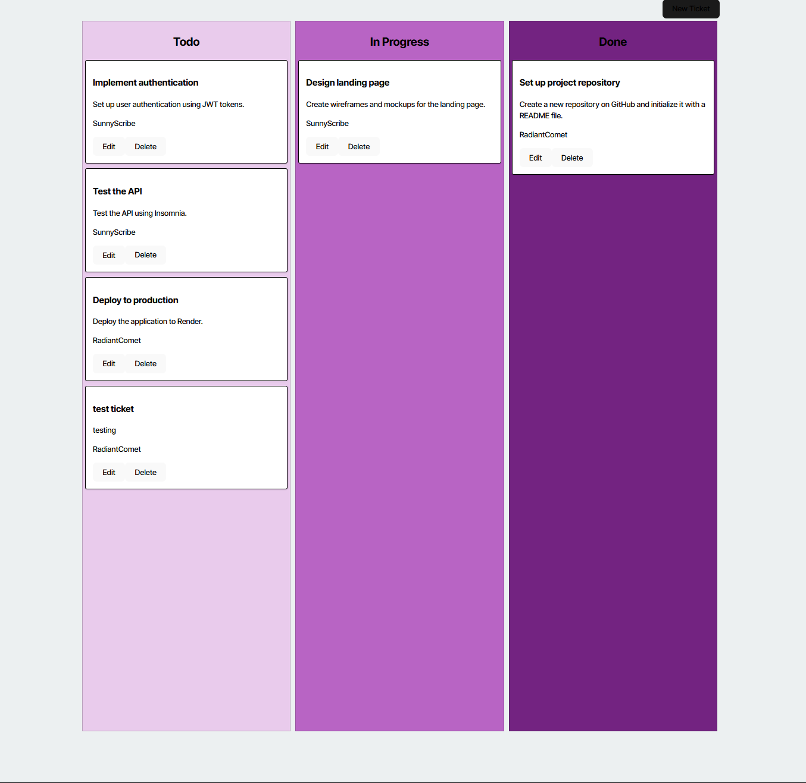

# Kanban Board with JWT Authentication

A full-stack Kanban board application secured with JSON Web Tokens (JWT). Users can register, log in, and manage tasks on a drag-and-drop board. The backend is built with Node.js, Express, Sequelize and PostgreSQL; the frontend is built with React and React Router.  

---

## Table of Contents

- [Features](#features)  
- [Tech Stack](#tech-stack)  
- [Prerequisites](#prerequisites)  
- [Installation](#installation)  

---

## Features

- User registration and login with JWT  
- Protected REST API routes for creating, updating, and deleting tasks  
- Drag-and-drop Kanban board UI (columns: To Do, In Progress, Done)  
- Sequelize ORM with PostgreSQL persistence  
- Client-side route guards using React Router  
- Easy deployment to Render or similar platforms  

---

## Tech Stack

- **Backend**: Node.js, Express, Sequelize, PostgreSQL  
- **Authentication**: JSON Web Tokens (JWT)  
- **Frontend**: React, React Router, CSS Modules (or Tailwind)  
- **Dev Tools**: nodemon, concurrently, dotenv  

---

## Prerequisites

- [Node.js](https://nodejs.org/) v16+  
- [npm](https://npmjs.com/) v8+  
- [PostgreSQL](https://www.postgresql.org/) v12+  

---

## Installation

1. **Clone the repo**  
   ```bash
   git clone https://github.com/your-username/kanban-jwt.git
   cd kanban-jwt




<video controls src="2025-05-07 00-10-24.mp4" title="Title"></video>